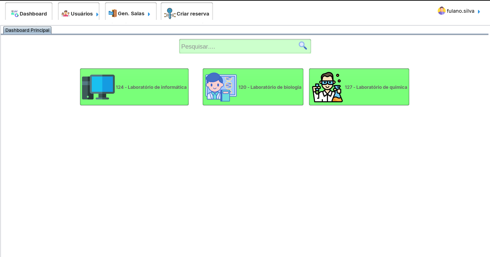

<h1 align="center">SecureKey: Sistema de Controle de Chaves Screens (v0.0.0)</h1>

Equipe do Projeto: Adimael, Bruno, Carolina, Geovanna, Luana e Tainá.

 

Interessados (Stakeholders): Porteiros, Coordenação Acadêmica, professores e funcionários
terceirizados.

Interessados (Stakeholders): Porteiros, Coordenação Acadêmica, professores e funcionários
terceirizados.

<h3>Metas do projeto (Objetivos):</h3>

  - Garantir que apenas pessoas autorizadas tenham acesso às chaves, reduzindo o risco
de roubo, vandalismo ou acesso não autorizado a áreas sensíveis do campus;
  - Facilitar o processo de empréstimo e devolução de chaves, reduzindo o tempo gasto
pelos funcionários na busca por chaves perdidas ou mal colocadas;
  - Manter um registro digital preciso de quem pegou cada chave, quando e para qual
finalidade, proporcionando transparência e responsabilidade no uso das chaves;
  - Manter um inventário atualizado das chaves e seus locais de uso, facilitando a
reposição e manutenção adequada.

<h3>Metas Entregáveis (Objetivos específicos):</h3>

  - Levantamento de requisitos para construção do sistema;
  - Elaboração da documentação UML do sistema;
  - Construção do projeto lógico do banco de dados, bem como sua implementação;
  - Projeto e análise da interface em conformidade com as boas práticas do design centrado no usuário e utilizando os conhecimentos quanto às Leis de UI/UX;
  - Realização de testes com a finalidade de averiguar a qualidade e identificar possíveis
erros durante o processo de implementação do sistema.

<h3>Escopo e exclusão</h3>

### Dentro do escopo:
● Desenvolver a arquitetura e o design do sistema de gerenciamento de
chaves, incluindo a definição da estrutura de banco de dados, interface
de usuário e fluxo de trabalho do sistema;
● Entender as necessidades específicas da instituição em relação ao
controle e gerenciamento de chaves, incluindo requisitos de segurança,
funcionalidades desejadas e integração com sistemas existentes;

● Desenvolver e testar o software de gerenciamento de chaves de acordo
com os requisitos estabelecidos, garantindo sua funcionalidade,
segurança e usabilidade.

## Fora do escopo:
● Desenvolvimento de integrações adicionais com outros sistemas ou
aplicativos que não foram identificadas como requisitos durante a fase
de levantamento de requisitos do projeto;
● Distribuição do software pelos campi.

## Cronograma

<h3>Tecnologias utilizadas:</h3>

#### FrontEnd

#### BackEnd

<h3 align="center">
Screenshots do projeto
</h3>

